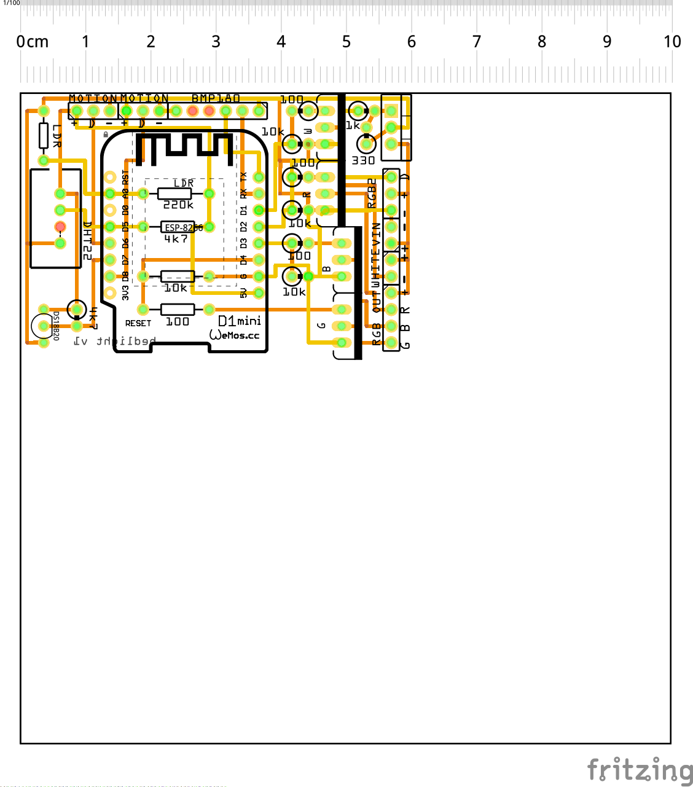

# what this is about
using an ESP8266 (Wemos D1 Mini to be precise) for controlling an LED strip and some sensors

  

# things you need
## hardware
* LED strip (12V RGB strip or WS2801 LED strip, see [FastLED](https://github.com/FastLED/FastLED) for supported ones)
* 12V white high power LED
* Wemos D1 mini
* power supply 12V or 5V, 1A minimum depending on the used LED strip.
Optional:
* DHT22 temperature and humidity sensor and/or DS18B20 temperature sensor
* 4.7k resistor for the DHT22 and/or DS18B20
* LDR 
* matching resistor for voltage divider for the LDR (something like 220k should be ok)
* PIR sensors for motion sensing

## software
To get started, you need a machine with the following software installed. A Rasperry Pi works nicely.
* an MQTT broker (e.g. [Mosquitto](https://mosquitto.org/))
* a command line MQTT client for testing

for Ubuntu/Debian/Raspbian, this should install everything necessary:
```
sudo apt-get install mosquitto-clients mosquitto
```

# configuration
Copy src/credentials_example.h to src/credentials.h, open it in a text editor and 
* put your WIFI credentials and MQTT server address in there

Then edit the `#define`s for which temperature sensor to use etc. in src/config.h

# flashing 
You can use the Arduino IDE or PlatformIO. See platformio.ini for library dependencies.
Some information about [OTA updating](http://docs.platformio.org/en/stable/platforms/espressif8266.html#over-the-air-ota-update)

Flashing has to be done initially over USB. Afterwards you can flash OTA.
```
platformio run -t upload -e d1_mini
```

example for flashing device OTA listening on IP 192.168.3.131:
```
platformio run -t upload -e d1_mini --upload-port 192.168.3.131
```
# MQTT topics
MQTT is used for communication from/to the device. See config.h for topics.

